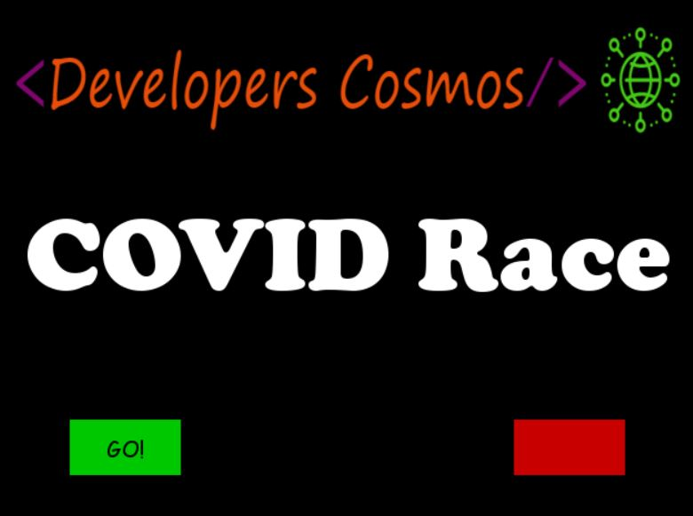
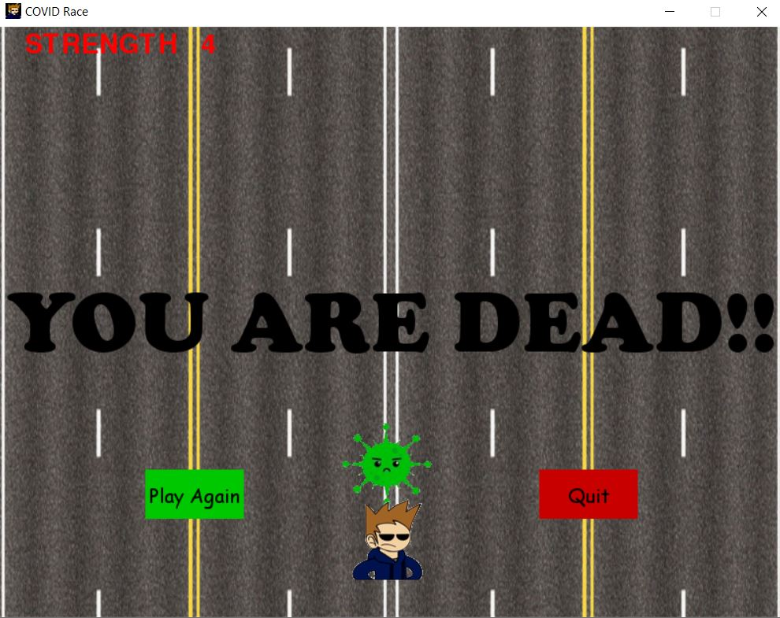
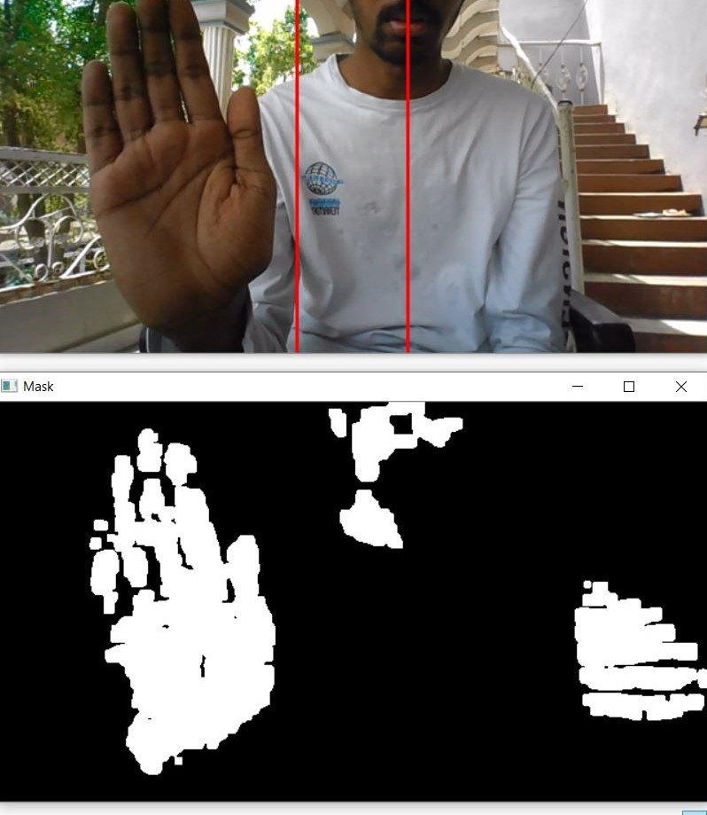

# 

A 2d <b>Covid Race Game</b> is created using python and pygame library. Also user can control the PLAYER with gestures which is achieved through AI.

[](https://github.com/developers-cosmos/COVID-Race-Game/graphs/commit-activity)  


## Run :runner:

To run the Game on your desktop clone the repository and run the below command.<br>
Requires python-3 and pip installed.

```python
pip install -r requirements.txt
python "COVID Race Game.py"
```
## Downloads

* To download Gesture Conrol Application [click here.](https://bit.ly/COVID-Race-Game-GestureControlAIapplication)
* To download sample videos of COVID RACE GAME [click here.](https://bit.ly/COVID-Race-Game-VideoDownload)


## Game Instructions

### Controls :game_die:

Key | Action
---|---
Left arrow  :arrow_left: | Move Left
Right arrow :arrow_right: | Move Right
Space ⏸️ | Pause & Resume

# 


### Powerups :tropical_drink:

Object | Effect
---|---
Strength 💪 | (+1) PLAYER strength increases as he cross a virus 🦠.
Santizer 🧴 | (Powerup). Causes the player to get into SAFE MODE for few seconds.
Police 👮 | (Powerdown). Causes the player to drop down the strength if PLAYER touches it.


### Rules

* Hitting an Virus 🦠 unit will INSIANTLY KILL you.
* DO NOT touch corners it will KILL you.
* Hitting an police unit 👮 will decrease your strength.
* Take health unit 🧴 to escape for next 4 virus units.


### Notes on Gesture Control

* First of all to download Gesture Conrol Application [click here.](https://bit.ly/COVID-Race-Game-GestureControlAIapplication)
* To start the application click on main.exe after downloading Gesture Conrol Application , two windows will be opened for you Deepgaze screen and Mask screen.
    # 
* In order to run the service click anywhere on Mask window and press 'a' to start.
* Now you can use the application with gestures you can see a green dot on the Deepgaze screen.
* To stop the service click anywhere on the Deepgaze screen and press 'q' to stop.

* <b>Important Note : </b>USE any object with RED color for       gesture control. If you want another color replace 6 templates in "COVID RACE GAME - Gesture Controls" directory with your favorable one.

## Assets

Asset | Credits
---|---
Sprite sounds | Effects from YouTube Audio Library.
Sprites | Google images

## Refernces
 1. [Pygame.](https://realpython.com/pygame-a-primer/)
 2. [Deepgaze.](https://github.com/mpatacchiola/deepgaze)

# Thank you :smile:
